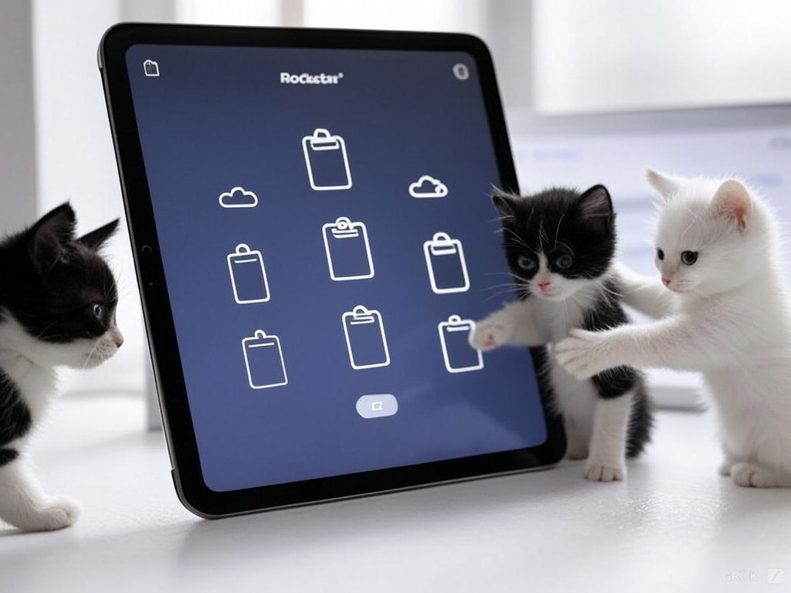
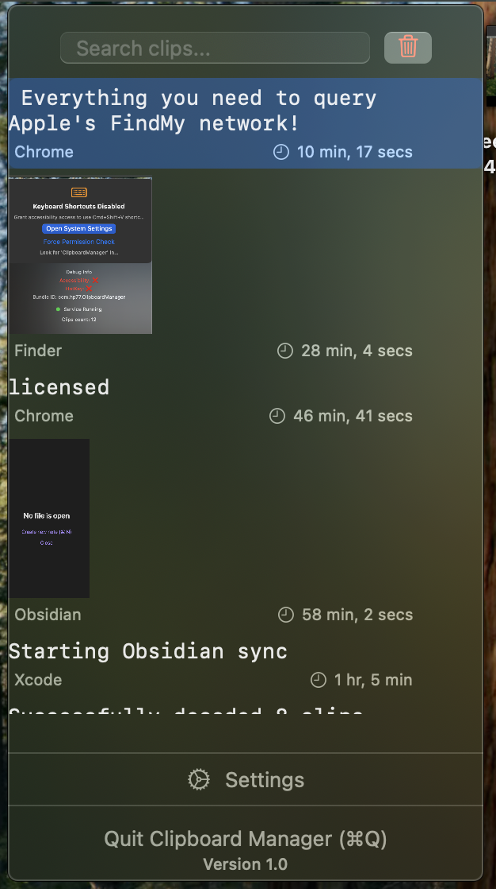

# Rockstar - Clipboard Manager



A powerful clipboard manager for macOS that seamlessly integrates with your workflow. Copy any content - text, images, or files - and access them quickly through a native macOS app. Optionally sync your clipboard history with Obsidian for permanent storage and organization.


<a href="https://www.producthunt.com/posts/rockstar-clipboard-manager?embed=true&utm_source=badge-featured&utm_medium=badge&utm_souce=badge-rockstar&#0045;clipboard&#0045;manager" target="_blank"></a>




[Demo on youtube](https://youtu.be/RYRlP_skwrs)

## Features

- **Quick Access**: Access your clipboard history instantly through the menu bar
- **Universal Search**: Find any copied content quickly with the powerful search interface
- **Rich Content Support**: 
  - Text with formatting
  - Images and files
  - Source application tracking
  - Automatic metadata extraction
- **Obsidian Integration**: Sync selected clips to your Obsidian vault
- **Privacy-Focused**: All data stored locally on your machine

## Architecture

```ascii
┌─────────────────┐     ┌──────────────┐
│  Native UI      │     │  Obsidian    │
└────────┬────────┘     └───────┬──────┘
         │                      │
    ┌────┴──────────────────────┴────┐
    │        Core Go Service         │
    ├────────────────┬──────────────┐│
    │ Clip Manager   │ Categorizer  ││
    ├────────────────┼──────────────┤│
    │ Search Engine  │ Sync Manager ││
    └────────────────┴──────────────┘│
         │                    │
    ┌────┴────────────┐  ┌───┴────┐
    │  SQLite + FTS5  │  │ Backup │
    └─────────────────┘  └────────┘
```

The application is built with a hybrid architecture:
- **Frontend**: Native macOS app built with SwiftUI for optimal performance and integration
- **Backend**: Go service handling clipboard monitoring, storage, and search
- **Storage**: SQLite with FTS5 for efficient full-text search
- **Sync**: Optional Obsidian integration for permanent storage

## Installation

### Prerequisites
- macOS 12.0 or later
- [Download the latest release](https://github.com/yourusername/clipboard-manager/releases)

### Quick Setup
1. Download and mount the DMG file
2. Drag ClipboardManager.app to your Applications folder
3. Launch the app - it will appear in your menu bar
4. Grant necessary permissions when prompted

For detailed installation instructions and developer guide for creating releases, see [INSTALL.md](INSTALL.md).

## Development

### Prerequisites
- Go 1.21 or later
- Xcode 14.0 or later
- SQLite

### Project Structure
```
.
├── ClipboardManager/       # Native macOS SwiftUI app
├── cmd/                    # Command-line tools
├── internal/              # Core Go implementation
│   ├── clipboard/         # Clipboard monitoring
│   ├── obsidian/         # Obsidian integration
│   ├── server/           # HTTP API server
│   ├── service/          # Core service
│   └── storage/          # Storage implementation
└── examples/             # Example implementations
```

### Building from Source

1. Build the Go backend:
```bash
go build ./cmd/clipboard-manager
```

2. Open the Xcode project:
```bash
open ClipboardManager/ClipboardManager.xcodeproj
```

3. Build and run the macOS app through Xcode

### Testing
```bash
go test ./...
```

## Contributing

1. Fork the repository
2. Create your feature branch
3. Commit your changes
4. Push to the branch
5. Create a new Pull Request

## License

MIT License - see LICENSE file
