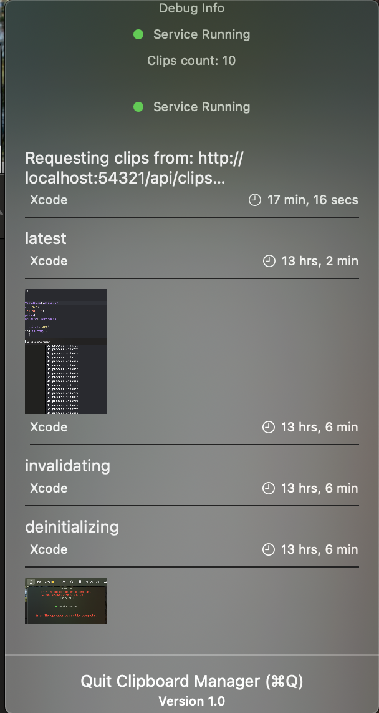

# Clipboard-manager

Not your another clipboard manager.

Copy any number of content be it text, image or whatever.
Choose to sync them with your choice of Note taking app(current support only for Obsidian), or use the native macOS app for quick access.

## Updates



## Architecture

```ascii
┌─────────────────┐     ┌──────────────┐
│  Native UI      │     │  Obsidian    │
└────────┬────────┘     └───────┬──────┘
         │                      │
    ┌────┴──────────────────────┴────┐
    │        Core Go Service         │
    ├────────────────┬──────────────┐│
    │ Clip Manager   │ Categorizer  ││
    ├────────────────┼──────────────┤│
    │ Search Engine  │ Sync Manager ││
    └────────────────┴──────────────┘│
         │                    │
    ┌────┴────────────┐  ┌───┴────┐
    │  SQLite + FTS5  │  │ Backup │
    └─────────────────┘  └────────┘
```

## Core Features

1. **Clipboard Monitoring**
   - Native macOS clipboard integration
   - Support for text, images, and files
   - Automatic metadata extraction
   - Source application tracking

2. **Storage System**
   - Hybrid storage approach:
     - Small items (<10MB) stored in SQLite
     - Large items (10MB-100MB) stored in filesystem
     - Content deduplication using SHA-256 hashing
   - Metadata storage and indexing
   - CRUD operations with context support

3. **Search Capabilities**
   - Full-text search for text content
   - Filter by content type
   - Sort by timestamp or usage
   - Tag-based filtering

## Usage

### Basic Usage

```go
// Initialize storage
store, err := sqlite.New(storage.Config{
    DBPath: "clipboard.db",
    FSPath: "files",
})

// Create clipboard monitor
monitor := clipboard.NewMonitor()

// Create and start service
clipService := service.New(monitor, store)
clipService.Start()
defer clipService.Stop()
```

### Custom Implementation

You can implement your own storage or monitor by implementing the interfaces:

```go
// Custom storage implementation
type MyStorage struct {
    // Your fields
}

func (s *MyStorage) Store(ctx context.Context, content []byte, clipType string, metadata types.Metadata) (*types.Clip, error) {
    // Your implementation
}

// Custom monitor implementation
type MyMonitor struct {
    // Your fields
}

func (m *MyMonitor) Start() error {
    // Your implementation
}
```

See `examples/core_usage.go` for more detailed examples.

## Command Line Tool

The included command-line tool provides a simple way to run the clipboard manager:

```bash
# Run with default settings
clipboard-manager

# Run with custom paths
clipboard-manager -db /path/to/db -fs /path/to/files

# Run with verbose logging
clipboard-manager -verbose
```

## Example Implementations

1. **CLI Example** (`examples/cli/`)
   - Command-line interface for searching and pasting
   - Basic clipboard operations

2. **TUI Example** (`examples/tui/`)
   - Terminal user interface
   - Interactive clipboard history browsing
   - Vim-style keybindings

## Project Structure

```
.
├── cmd/                    # Command-line tool
├── internal/
│   ├── clipboard/         # Clipboard monitoring
│   ├── server/           # HTTP API server
│   ├── service/          # Core service
│   └── storage/          # Storage implementation
├── macos/                # Native macOS app
│   └── ClipboardManager/
│       ├── Sources/      # Swift source files
│       └── Resources/    # App resources
├── pkg/
│   └── types/            # Public types
└── examples/             # Example implementations
```

## macOS App Setup

### Prerequisites
- Xcode 14.0 or later
- macOS 12.0 or later
- Command Line Tools for Xcode

### Building the App

1. Run the setup script:
   ```bash
   chmod +x macos/ClipboardManager/setup.sh
   ./macos/ClipboardManager/setup.sh
   ```

2. Open Xcode and create a new project:
   - File > New > Project
   - Choose macOS > App
   - Set product name to "ClipboardManager"
   - Choose your team and bundle identifier

3. Replace the generated files:
   - Delete the generated Swift files
   - Drag files from `ClipboardManager/Sources/` into your project
   - Add files from `ClipboardManager/Resources/` to your project
   - Ensure "Copy items if needed" is checked

4. Configure the project:
   - Select the project in the navigator
   - Select the ClipboardManager target
   - Under Signing & Capabilities:
     - Choose your development team
     - Set a unique bundle identifier
   - Under Info:
     - Add "Application is agent (UIElement)" (LSUIElement) = YES
     - Add "Privacy - Clipboard Usage Description" with appropriate text

### Running the App

1. Start the Go backend:
   ```bash
   go build ./cmd/clipboard-manager
   ./clipboard-manager --verbose
   ```

2. Run the macOS app:
   - Open the Xcode project
   - Select the ClipboardManager scheme
   - Click Run (⌘R)

### Features
- Menu bar integration for quick access
- Real-time clipboard history display
- Quick paste functionality
- Source app tracking
- Timestamp information

### Troubleshooting

1. HTTP Connection Issues:
   - Verify the Go service is running (`ps aux | grep clipboard-manager`)
   - Check the port isn't in use (`lsof -i :54321`)
   - Review logs with --verbose flag

2. Clipboard Monitoring Issues:
   - Check Privacy & Security settings
   - Verify app has clipboard access
   - Review system logs

3. Build Issues:
   - Clean build folder (Product > Clean Build Folder)
   - Reset package caches (`go clean -modcache`)
   - Update Go dependencies (`go mod tidy`)

## Development

### Prerequisites
- Go 1.21 or later
- SQLite

### Building
```bash
go build ./cmd/clipboard-manager
```

### Testing
```bash
go test ./...
```

## License

MIT License - see LICENSE file

## Contributing

1. Fork the repository
2. Create your feature branch
3. Commit your changes
4. Push to the branch
5. Create a new Pull Request
